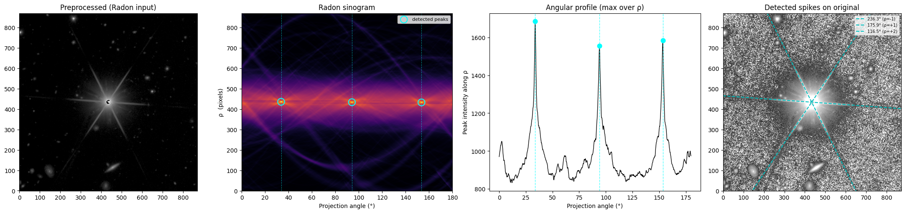

# spikeout

Detect, measure, and mask diffraction spikes in astronomical images.

## Installation

```bash
pip install .
```

Or for development:

```bash
pip install -e ".[dev]"
```

Catalogue mode (FITS + WCS support) requires astropy:

```bash
pip install ".[astropy]"
```

## Example

Example of spikeout results on a real Euclid Q1 NISP image, showing detected
spikes and the Radon sinogram.  The diagnostic plot shows the preprocessed
image, sinogram restricted to the central ρ band, and angular profile with
detected peaks.




## Quick start

```python
import spikeout

# Detect spikes
result = spikeout.detect(cutout_data)

# Tune for your data
result = spikeout.detect(
    cutout_data,
    min_peak_separation_deg=20.0,   # minimum angle between spikes
    morph_radius=0,                 # skip morphological filtering
    peak_prominence=0.8,            # aggressive initial peak selection
    min_snr=5.0,                    # reject insignificant spikes
    max_rho_fraction=0.1,           # lines must pass near centre
)

# Access results
print(result.angles)        # image-plane angles (degrees)
print(result.snr)           # SNR of each detected spike
print(result.rho_physical)  # perpendicular offset from centre (pixels)

# With length measurement
result = spikeout.detect(cutout_data, measure_lengths=True)
for spike in result.lengths:
    print(f"{spike.angle_deg:.1f}°: {spike.length_total:.0f} px total")
    print(f"  pos arm: {spike.length_pos:.0f} px, neg arm: {spike.length_neg:.0f} px")
    if not spike.converged_pos or not spike.converged_neg:
        print("  (length extrapolated — spike reached measurement boundary)")

# Diagnostic plot
fig = spikeout.plot_diagnostics(cutout_data, result)
```

## Features

### Spike detection

`detect()` returns a `SpikeResult` with:

| Attribute | Description |
|---|---|
| `angles` | Display-frame spike angles (degrees) |
| `snr` | Angular-profile SNR of each spike |
| `rho_physical` | Perpendicular offset from image centre (pixels) |
| `lengths` | Per-arm length measurements (when `measure_lengths=True`) |
| `sinogram` | Full Radon sinogram |
| `prepared_image` | Preprocessed image fed to the Radon transform |

### Spike masking and DS9 regions

```python
# Boolean pixel mask of spike-contaminated pixels
mask = spikeout.spike_mask(result, image.shape)

# Write DS9 region file (pixel coordinates)
spikeout.write_ds9_regions("spikes.reg", result, image.shape)
```

### Stellar halo mask

`halo_mask()` finds the radius where the stellar halo falls to
`threshold_nsigma × σ_MAD` above the background, using a robust azimuthal
median profile (resilient to neighbours and diffraction spikes).

```python
mask, radius_px = spikeout.halo_mask(
    cutout_data,
    threshold_nsigma=3.0,   # halo edge: bg + 3 × MAD
    min_radius=5.0,          # minimum mask radius
)
```

`CatalogueEntry.halo_mask` / `CatalogueEntry.halo_radius` are populated
automatically when `halo_mask_kw` is passed to `catalogue_detect()`.

### Catalogue mode

Process many sources in a FITS image in one call.  Cutouts are extracted with
memory-mapping so only the required pixels are read.

```python
from astropy.coordinates import SkyCoord

coords = SkyCoord([ra1, ra2, ...], [dec1, dec2, ...], unit="deg")

entries = spikeout.catalogue_detect(
    coords,
    "image.fits",
    cutout_size=256,       # pixels
    n_jobs=-1,             # use all CPU threads
    halo_mask_kw={},       # also run halo_mask with defaults
    min_snr=5.0,           # forwarded to detect()
)

summary = spikeout.catalogue_summary(entries)
print(f"{summary['with_spikes']} / {summary['total']} sources have spikes")
print(f"median halo radius: {np.median(summary['halo_radii']):.1f} px")

fig = spikeout.plot_catalogue(entries)

# Write sky-coordinate DS9 regions for all sources
spikeout.write_catalogue_ds9_regions(
    "catalogue_spikes.reg", entries, pixel_scale_arcsec=0.1
)
```

## How it works

### Preprocessing

1. **Azimuthal median subtraction** — removes the radially symmetric PSF
   (core + halo), isolating asymmetric structure like diffraction spikes.
2. **Sigma clipping** — zeros pixels below `sigma_clip × σ_MAD`, suppressing
   the noise floor.
3. **Morphological opening** — erodes compact sources (neighbours, hot pixels,
   cosmic rays) while preserving elongated spikes.
4. **Asinh scaling** — compresses dynamic range softly.  The stretch scale is
   computed from the inner 50 % of the image radius so bright off-centre
   sources do not compress the central spike signal.

### Detection

The **Radon transform** projects the preprocessed image along many angles.
Diffraction spikes produce bright peaks in the sinogram at their corresponding
(ρ, θ) coordinates.

Peak detection is restricted to the **central ρ band** (`|ρ| ≤ max_rho_px`)
so that off-centre bright sources never influence the threshold, peak
positions, ρ assignments, or SNR estimates.  For saturated stars with a
NaN/zero core the band is automatically widened by the blank-core radius so
that spike arms — which peak at the edge of the saturated region — are still
detected.

Two quality filters reject false positives:

- **ρ filter** — lines must pass within `max_rho_fraction × min(shape)/2`
  pixels of the star centre.  Automatically extended for saturated cores.
- **SNR filter** — each peak's height in the angular profile must exceed
  `min_snr × σ_MAD` above the median.  This naturally rejects featureless
  images (galaxies, faint stars without visible spikes).  Set `min_snr=0.0`
  to disable.

### Length measurement

Each spike arm is traced outward via a perpendicular swath profile (median
over `swath_width` pixels at each step).  The measurement window starts at
`initial_radius` and grows by `radius_growth_factor` in steps if the spike has
not yet ended — avoiding the cost of a full-image walk for short spikes.  At
`max_radius`, a power-law fit (`A / r^α`) to the profile tail extrapolates the
endpoint; `SpikeLengths.converged_pos/neg` flags whether the endpoint was
measured or extrapolated.

NaN/zero star cores are handled automatically: the blank-core radius is
detected and the inner (corrupted) segment of the profile is excluded from
both endpoint detection and the power-law fit.

### Halo masking

`halo_mask()` builds a robust azimuthal median radial profile (1-pixel-wide
annuli, median per bin), smooths it with a 1-D median filter, and finds the
outermost radius where the profile exceeds `bg + threshold_nsigma × σ_MAD`.
The azimuthal median is resilient to any single source occupying less than 50%
of an annulus (neighbours, spike lines).

## API reference

### Core

| Function / class | Description |
|---|---|
| `detect(image, ...)` | Detect spikes via Radon transform |
| `SpikeResult` | Detection output dataclass |
| `measure_spike_lengths(image, result, ...)` | Measure per-arm spike lengths |
| `SpikeLengths` | Length measurement dataclass |

### Preprocessing

| Function | Description |
|---|---|
| `prepare_image(image, ...)` | Full preprocessing pipeline |
| `azimuthal_median(image, ...)` | Azimuthal median PSF model |
| `find_centre(image)` | Auto-detect source centre |

### Masking and regions

| Function | Description |
|---|---|
| `halo_mask(image, ...)` | Circular stellar halo mask |
| `spike_mask(result, shape, ...)` | Boolean pixel mask of spike arms |
| `spike_box_regions(result, shape, ...)` | DS9 box region strings |
| `write_ds9_regions(path, result, ...)` | Write DS9 region file (pixels) |
| `write_catalogue_ds9_regions(path, entries, ...)` | Write DS9 region file (sky coords) |

### Catalogue mode

| Function / class | Description |
|---|---|
| `catalogue_detect(coords, path, ...)` | Batch detection on a FITS image |
| `CatalogueEntry` | Per-source result dataclass |
| `catalogue_summary(entries)` | Aggregate statistics across entries |
| `plot_catalogue(entries, ...)` | Grid plot of cutouts with spike overlays |

### Plotting and geometry

| Function | Description |
|---|---|
| `plot_diagnostics(image, result, ...)` | Multi-panel diagnostic figure |
| `radon_line_to_image(rho, theta, shape)` | (ρ, θ) → pixel endpoints |
| `sinogram_rho_to_physical(indices, n_rho)` | Sinogram row index → physical ρ |
| `mad_std(data)` | Robust σ via median absolute deviation |
